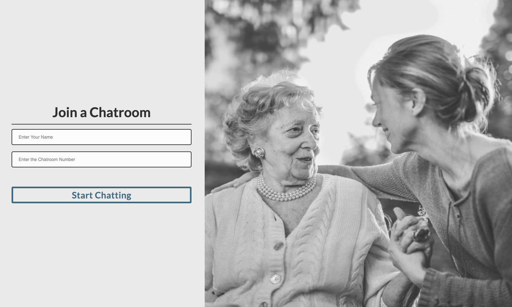
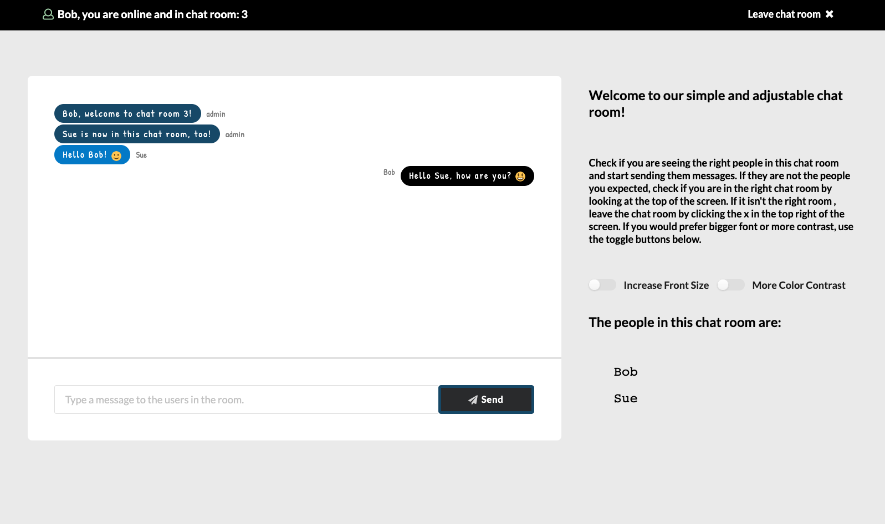
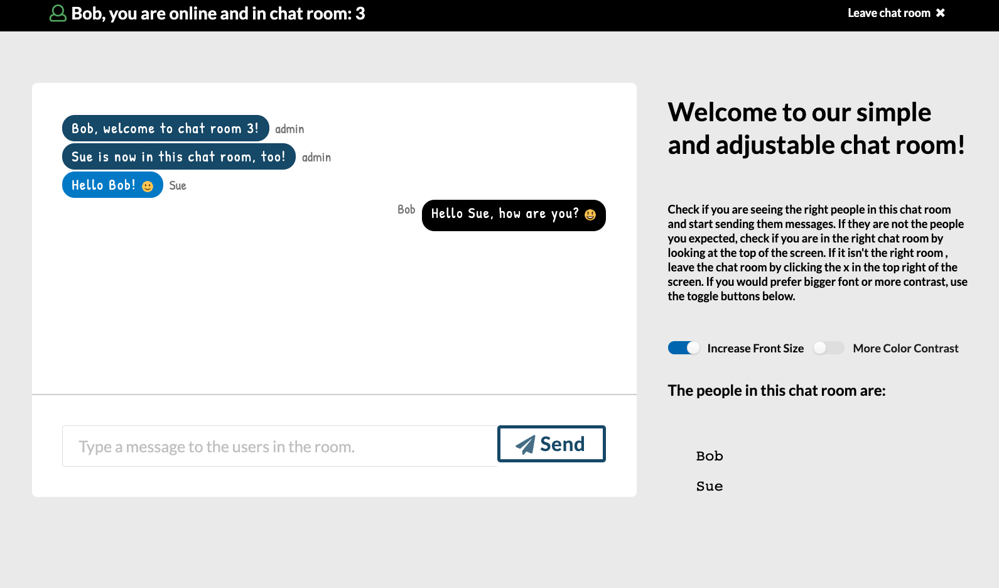

# Simple Chat App for Seniors

**_Work in progress!!_**

## Table of Content

<!-- - [Deployed Link](#Deployed-Link) -->

- [User Story](#User-Story)
- [Description](#Description)
- [Installation](#Installation)
- [Usage](#Usage)
- [Technologies](#Technologies)

<!-- ## Deployed Link: -->

Work in progress!

Landing Page


Chat room


Chat room after font adjustment


## User Story

```
As a senior citizen with poor eye sight and little technology knowledge I want a chat application to connect with my family that is simple, easy to use and can be adjusted to my vision needs.
```

## Description

React chat application that implements accessibility standards and allows user's with slightly impaired eye sight and little technological knowledge to chat with other users.

## Installation

Git clone and run the following command:

```
    npm install
```

## Usage

```
    npm run start
```

## Technologies

React.js, Node.js, Socket.io, Express.js, Sass, react-emoji

## Contribution

Pull requests are welcome. Code of Conduct: Standard (Fork, Clone, Commit, Push and Create Pull requests).

## Credits

Background photo by xx from Unsplash

## Questions

If you have any questions about the repo, open an issue.


